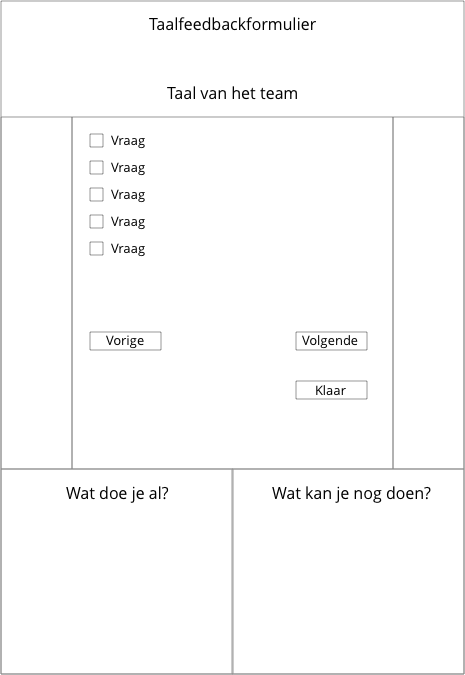

# Taal als Tool

Een feedbackformulier voor taalproducten. Het formulier bestaat uit twee onderdelen:

- **Client** : Het invulformulier met checkboxes en een aanroep van de mailer als alles is ingevuld.
- **Server** : Als de mailer wordt aangeroepen via POST, stuurt hij een mail naar het meegegeven email adres. 

<br>
<br>

## Client

- Plaats de `html, js, css` uit de **client** map online.
- Check dat de `fetch` opdracht in de `js` file naar de juiste server verwijst.

```javascript
function sendMail(mail, dataW, dataR) {
     fetch('http://localhost:8080/email', options) 
}
```


<br>
<br>

## Server

- Installeer de packages met `npm install` in de **server** map. 
- Maak een `.env` file en plaats daarin de naam en het wachtwoord van het gebruikte email adres. Volg het voorbeeld van .env.example
- Run de server in een `node` omgeving.

```javascript
node mailer.js
```

<br>
<br>

## Todo

- Er moeten kopjes tussen de antwoorden komen. 
- De mail moet naar een vast email adres verstuurd worden, vraag na naar welke. (Dit moet ook vermeld worden op de website).
- Nadat de mail verstuurd is moet je visuele feedback krijgen op de site, nu gebeurd er nog niks. 
- Er was een wens om een contactformulier op de webpagina te hebben, vraag na of dit nog steeds de bedoeling is en ontwerp hem 😉. 
- Er moeten in plaats van ‘vorige’ en ‘volgende’ pijltjes komen.
- Aan het einde als er op ‘finished’ is gedrukt, moeten de boxen weggaan. Er moet echter wel nog een vorige button zijn zodat je terug kan om iets te veranderen. 
- Layout aanpassen volgens onderstaand **wireframe**.
- Grafisch ontwerp volgens [Huisstijl Hogeschool Rotterdam](https://www.hogeschoolrotterdam.nl/go/huisstijl/)
- Online installeren op een node server, bv. **netlify**, **heroku** of serverruimte van school.
- Check of email versturen ook werkt vanaf online server in plaats van localhost.

<Br>
<br>

## Wireframe



<Br>
<br>

Voor vragen kan je terecht bij Mattijn Stolk of Erik Katerborg.